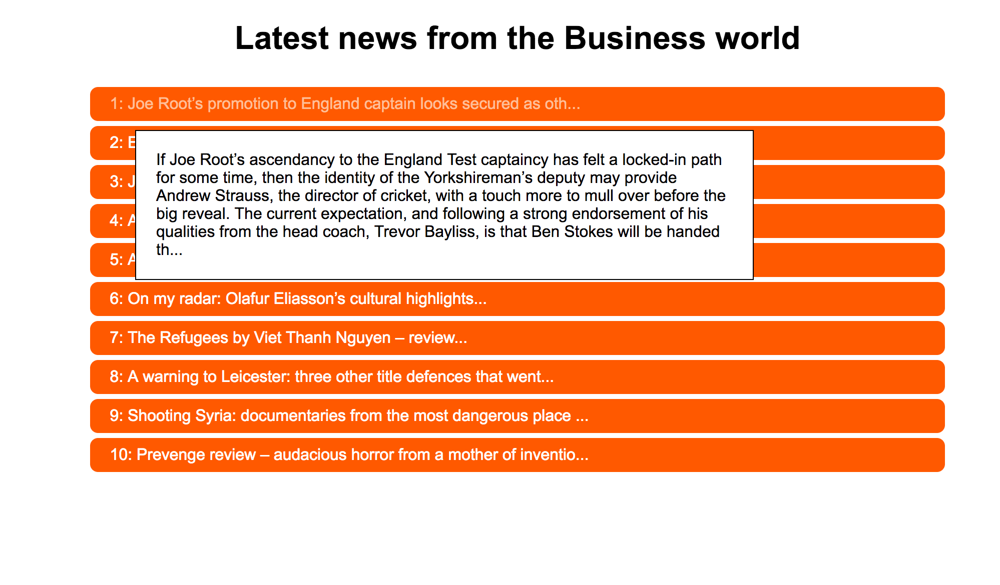

News Summary Application
==================

Introduction
-------
The News Summary app searches for "business" within all the articles from the Guardian newspaper API and displays them on a page. When hovering above an article a short summary is displayed and Clicking on a headline will show the full article. The app is designed as a single page web app using JavaScript, CSS and HTML. The app sends a request to the Guardian API using an XTMLHttp object and the response is translated into a JSON object. The app uses javascript callbacks to handle the execution process of the DOM to increase the user experience when the layout is rendered to the page.

```
As a busy politician
I can see all of today's headlines in one place
So I know what the big stories of the day are


As a busy politician
I can read a summary of a news article
So I can get a few more details about an important story


As a busy politician
I can read a full news article
So that I can get an in depth understanding of a very important story


As a busy politician
I can see a picture to illustrate each news article when I browse headlines
So that I have something nice to look at


As a busy politician
I can read the site comfortably on my phone
Just in case my laptop breaks


As a busy politician
I can see whizzy animations in the app
To make my news reading more fun
```

Installation
-----
* Clone the repository to your local machine.


How to use the applicaton
-----

Open the index.html file in your favorite browser.An XTML request with a search query for "business" will be sent to the Guardian API and the top ten articles will be displayed once received from the Guardian API.

Technologies used
-----
* Javascript
* XTML requests
* Html
* CSS
* Guardian API

Areas to improve
-----
* Customize search query to the Guardian API
* User interface

Example
-----


